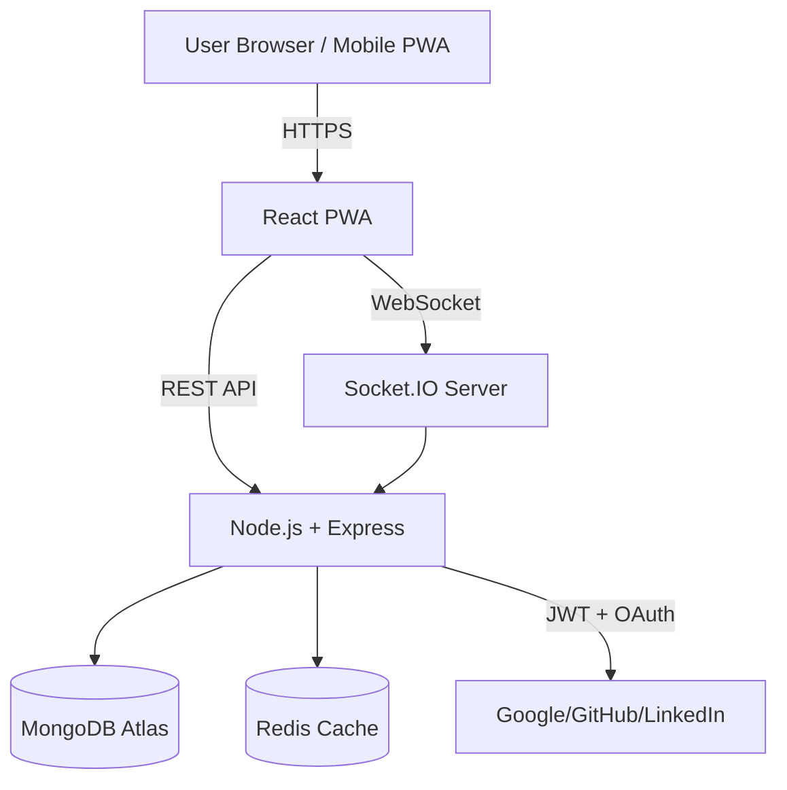
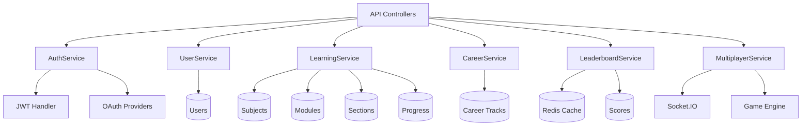

# LevelUpED - Gamified Learning Platform

A production-ready full-stack MERN application that transforms education through gamification, real-time multiplayer quizzes, and personalized learning paths.

## Overview

**Problem:** Traditional e-learning platforms lack engagement and fail to provide real-time collaborative experiences that keep students motivated.

**Solution:** LevelUpED combines gamification mechanics (points, streaks, leaderboards) with real-time multiplayer quiz battles and career exploration tools. Built as a Progressive Web App with offline support, it delivers a native app experience while maintaining web accessibility.

**Live Demo:** https://gamelearn-platform-2.onrender.com

## Key Features

### For Students
- **Gamified Learning:** Earn knowledge points, maintain learning streaks, and track study hours
- **Multiplayer Arena:** Real-time quiz battles with peers using Socket.IO
- **Progress Dashboard:** Visual analytics showing modules completed, learning streaks, and performance metrics
- **Career Exploration:** Personalized career track recommendations based on learning patterns
- **Leaderboards:** Global and subject-specific rankings to drive healthy competition
- **PWA Support:** Install as mobile app, works offline with service workers

### For Instructors
- **Content Management:** Create and organize subjects, modules, and sections
- **Student Analytics:** Monitor individual and cohort progress
- **Rich Content Editor:** Support for text, code snippets, images, and interactive elements

### For Admins
- **User Management:** Role-based access control (Student, Instructor, Admin)
- **Platform Analytics:** System-wide usage statistics and engagement metrics
- **Content Moderation:** Activate/deactivate learning materials

## Application Screenshots

### Student Dashboard


*Main dashboard showing learning metrics: modules finished, learning streak, knowledge points, and study hours. Features quick access to multiplayer arena and current curriculum.*

### System Architecture Diagrams
*High-level architecture showing React PWA frontend, Node.js backend with REST APIs and WebSocket support, MongoDB for persistence, and Redis for caching.*
*Service-oriented backend architecture with dedicated services for Auth, User, Learning, Career, Leaderboard, and Multiplayer features.*

## System Design

### High-Level Architecture



### Low-Level Design



## Tech Stack

**Frontend:**
- React 18 with Vite
- Socket.IO Client for real-time features
- Recharts for analytics visualization
- Workbox for PWA and offline support

**Backend:**
- Node.js 20 with Express 5
- MongoDB with Mongoose ODM
- Socket.IO for WebSocket communication
- JWT + Passport.js (OAuth: Google, GitHub, LinkedIn)
- Redis for leaderboard caching (optional)

**DevOps:**
- Docker for containerization
- Render.com for hosting
- MongoDB Atlas for database
- GitHub Actions ready (CI/CD)

## Local Setup

### Prerequisites
- Node.js 20+
- MongoDB (local or Atlas)
- npm or yarn

### Installation

```bash
# Clone repository
git clone https://github.com/sakeththammishetti1403/gamelearn-platform.git
cd gamelearn-platform

# Install backend dependencies
npm install

# Install frontend dependencies
cd client && npm install && cd ..

# Configure environment
cp .env.example .env
# Edit .env with your MongoDB URI, JWT secrets

# Run development servers
npm run dev
```

Access at `http://localhost:3000` (frontend) and `http://localhost:5000` (backend API)

### Docker Deployment

```bash
docker-compose up --build
```

Access at `http://localhost:5000`

## Scalability & Security

**Scalability:**
- Stateless JWT authentication enables horizontal scaling
- Redis caching for leaderboard queries reduces DB load
- Socket.IO with Redis adapter supports multi-instance deployments
- MongoDB indexes on frequently queried fields (userId, subjectId)

**Security:**
- Passwords hashed with bcryptjs (10 rounds)
- JWT tokens with 30-day expiration
- CORS configured for specific origins
- Input validation on all API endpoints
- OAuth 2.0 for third-party authentication

## Currently Working On

- [ ] AI-powered learning recommendations based on performance patterns
- [ ] Video content support with progress tracking
- [ ] Mobile app (React Native) using shared API
- [ ] Advanced analytics: time-series learning patterns, predictive modeling
- [ ] Peer-to-peer study rooms with video chat

## Author

**Saketh Thammishetti**
- GitHub: [@sakeththammishetti1403](https://github.com/sakeththammishetti1403)
- Email: thammishettisaketh104@gmail.com

---

**License:** ISC
